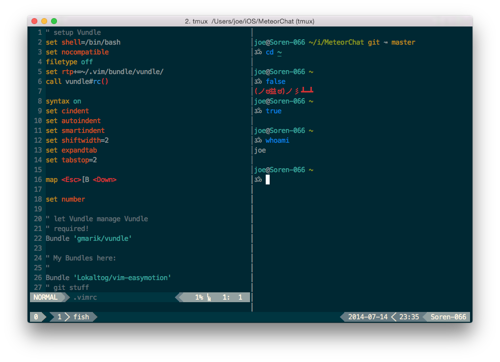

# pyro2927's dotfiles

Tired of using Dropbox, going to move all my dotfiles over to here.

## Setup

On OS X, you'll need `git` and the OS X command line tools installed (packaged with Xcode).

### Automatic

    curl -sSL https://raw.githubusercontent.com/pyro2927/dotfiles/master/auto_install.sh | bash

### Manual

    git clone https://github.com/pyro2927/dotfiles.git
    cd dotfiles
    sh ./install.sh
    sh ./symlink.sh

### Install Script

The included install script sets installs my favorite/main programs, and then sets `fish` as the default shell.

## Screenshot

## What's Installed?

The script is meant to work with both Ubuntu and OS X machines, though is more geared towards OS X.

### OS X

* [Homebrew](http://brew.sh/)
  * [rbenv](https://github.com/sstephenson/rbenv) w/ [ruby-build](https://github.com/sstephenson/ruby-build) plugin
  * [fish](http://fishshell.com/)
  * [tmux](http://tmux.sourceforge.net/)
  * [mercurial](http://mercurial.selenic.com/)
  * [Cask](http://caskroom.io/)
    * [Chrome](http://www.google.com/chrome/)
    * [iTerm2](http://iterm2.com/)
    * [iStat Menus](http://bjango.com/mac/istatmenus/)
    * [Razer Synapse](http://www.razerzone.com/synapse/)
    * [Karabiner](https://github.com/tekezo/Karabiner)
    * [Viscosity](https://www.sparklabs.com/viscosity/)
    * [Alfred](http://www.alfredapp.com/)
    * [Bartender](http://www.macbartender.com/)
    * [Steam](http://store.steampowered.com/)
    * [Spotify](https://www.spotify.com/)

## Notes

### Mac App Store

I purchase a lot of apps through the Mac App Store, and don't install them with [Cask](https://github.com/caskroom/homebrew-cask).  Some of my favorite apps are:

* [1Password](https://itunes.apple.com/us/app/1password-password-manager/id443987910) - Cross-platform password management
* [Base](https://itunes.apple.com/us/app/base-sqlite-editor/id402383384) - SQLite editor
* [DaisyDisk](https://itunes.apple.com/us/app/daisydisk/id411643860) - Disk space usage visualization
* [Divvy](https://itunes.apple.com/app/id413857545) - Window management
* [Glui](https://itunes.apple.com/us/app/glui-2/id918207447) - Screenshot tool
* [Transmit](https://itunes.apple.com/us/app/transmit/id403388562) - FTP/SFTP/WebDAV/S3 file transfer client

### Fonts

iTerm2 looks best with the solarizad dark theme and `14pt Meslo LG M DZ Regular for Powerline` font.

    wget https://raw.githubusercontent.com/altercation/solarized/master/iterm2-colors-solarized/Solarized%20Dark.itermcolors
    brew tap caskroom/fonts
    brew cask install font-meslo-lg-for-powerline
